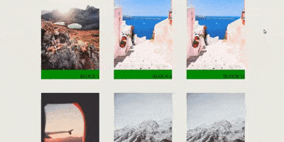
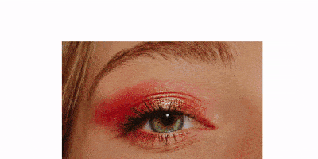
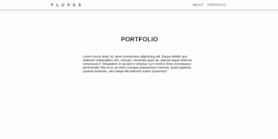
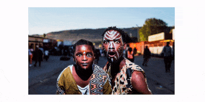
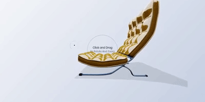

# REACT 2019-2021

> Here you will find all the lessons and projects I ve been working on since the beginning of my journey with REACT at Digital Career Institute until today.

 

### INTRODUCTION | INSTALLATION:

- Read more about the [**Node and Git Installation here**](./src/NODE_GIT_INSTALLATION.md) ⬅️

- Read more about the [**Security here**](./src/security.md) ⬅️

- Read more about the [**React installation/set-up here**](./src/INSTALLATION_REACT.md) ⬅️

- Read more about the [**styling**](./src/STYLING_TOOLS.md) 🌈

 
 

 

 

 
 
 

# RECENT

 

## Animations | Locomotive scroll | Misc

#### IMG Distortion using Shaders

- (redux /shaders / webgl / curtains.js)
- 2021

##### [Creative Distortion](https://github.com/nadiamariduena/creativ-img.distortion2)

 

 
 

##### [skew-distortion-on-scroll-locomotive](https://github.com/nadiamariduena/skew-distortion-on-scroll-locomotive)

 
 

 

 
 

 

## SKEW Scrolling

##### [smooth-skew-scrolling](https://github.com/nadiamariduena/react-smooth-skew-scrolling)

 
 

 

 
 

 

# REACT INTRO

[react 1](https://github.com/nadiamariduena/react-1)

[react 2](https://github.com/nadiamariduena/react-3day/tree/master/src)

[react 3](https://github.com/nadiamariduena/todo-react4)

 

### Exercises | projects

[to-do](https://github.com/nadiamariduena/todo-react)
[fake instagram](https://github.com/nadiamariduena/portfolio-insta)
[List / too many tries](https://github.com/nadiamariduena/react-list-dynamicnavbar)
[API News](https://github.com/nadiamariduena/react-news-api)

 

##### [Shop](https://github.com/nadiamariduena/fluxushome-shop)

##### [ANIMATED Menu by Wrong Akram "exercise" ](https://github.com/nadiamariduena/-anim-menu-react1)

##### [Firegram by Ninja "exercise"](https://github.com/nadiamariduena/Firegram)

##### [React & Redux Shopping Cart "exercise" ](https://github.com/nadiamariduena/first-redux-shopping-cart)

##### [FLUXUS shop](https://github.com/nadiamariduena/fluxushome-shop)

 

##### SCHOOL GROUP PROJECT

##### [ROSETTA Styles](https://github.com/nadiamariduena/myrosetta)

 

### Mapping data

 

[Json map images 1](https://github.com/nadiamariduena/react-json-version1)

[Json map images 2](https://github.com/nadiamariduena/react-json-version2)

[shop | props | search filter](https://nadiamariduena.github.io/react-router-intro-dci/)

[simple router set up](https://github.com/nadiamariduena/react-router-simple-layout)

[react-list-dynamicnavbar](https://github.com/nadiamariduena/react-list-dynamicnavbar)

 

#### Hamburger

##### [hamburger test1 responsive](https://github.com/nadiamariduena/react-responsive1)

##### [Hamburger cross closing | responsive](https://github.com/nadiamariduena/react-responsive1)

##### [Hamburger Styled Component (private)](https://github.com/nadiamariduena/react-resp-hamburger-styledcomponent2)

###### [Hamburger Styled Component 2 (public)](https://github.com/nadiamariduena/react-resp-hamburger-styledcomponents)

##### [responsive stretch](https://github.com/nadiamariduena/react-responsive-2)

 

#### z-index

##### [z-index helpful option (private)](https://github.com/nadiamariduena/nadiamariduena-portfolio)

#### z-index Modal

##### [react Modal](https://nadiamariduena.github.io/react-modal1/)

 

 

## Recap Lessons

##### [Lessons recap](https://github.com/nadiamariduena/react-recapitulation)

##### [Props beginner](https://github.com/nadiamariduena/react-props-video)

##### [React Router1 ](https://github.com/nadiamariduena/react-router-introduction)

##### [React Router2 + Fetch ](https://github.com/nadiamariduena/react-router2-fetch)

##### [componentWillMount, componentDidMount ](https://github.com/nadiamariduena/component-did-and-will-mount)

##### [All about HOOKS](https://github.com/nadiamariduena/react-hooks-recap)

##### [react-lazyloading-suspense ](https://github.com/nadiamariduena/react-lazyloading-suspense)

 
 

 

# FADING Animations

 

##### AOS | INTERSECTION OBSERVER

##### [animated-portfolio-with-aos](https://github.com/nadiamariduena/animated-portfolio-with-aos)

##### [animation-effects-onpage-scroll AOS](https://github.com/nadiamariduena/animation-effects-onpage-scroll)

##### [Navigation-hide-show-onscroll](https://github.com/nadiamariduena/react-hide-show-onscroll)

##### [Fade animation | Intersection Observer](https://github.com/nadiamariduena/animated-portfolio-with-intersection-observer)

 

 

 
 

 
 

## IMAGE REVEAL

##### [image reveal](https://github.com/nadiamariduena/react-imgreveal-mini-portfolio1)

##### [image reveal gsap](https://github.com/nadiamariduena/react-img-reveal1-gsap)

 
 

 

 
 

 

### THREEJS 3D | ANIMATION | BLENDER

##### [Process chair | Blender | Threejs ](https://github.com/nadiamariduena/3d-configurator-beginner1)

 

#### [all Threejs beginner Lessons](https://github.com/nadiamariduena/three-js)

##### [threejs cube and flag | 100% responsive](https://github.com/nadiamariduena/three-js/tree/master/three_responsive_scenes)

##### [3dflag-threejs](https://github.com/nadiamariduena/3dflag-threejs-react)

 

 

 

## React VR with (REACT NATIVE)

[React 360 _Hello_ Virtual Reality (introduction)](https://github.com/nadiamariduena/react-vr-intro1)

[ReactVR intro 2 (images) | VERCEL video install ](https://github.com/nadiamariduena/react-vr-intro2-images)

[ReactVR intro 3 (video)](https://github.com/nadiamariduena/react-vr-intro3-video)

[ReactVR intro 4 (importing 3D models)](https://github.com/nadiamariduena/react-vr-intro4-3dModels)

 

 

## Unity3D - React

_(private)_
[Unity3d - 360 Virtual Tour](https://github.com/nadiamariduena/unity3d-virtual-tour1)
