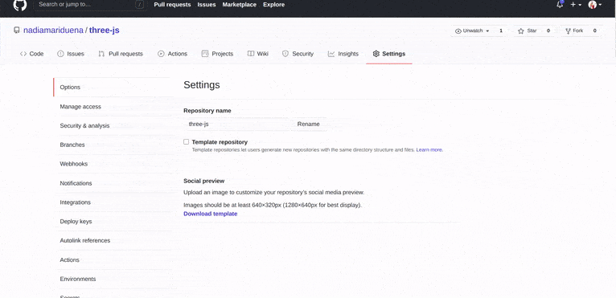

<br>
<br>

# 🍯

##### - CREATING AN APP /

##### - ISSUES /

##### - DEPLOYING TO GITHUB OR VERCEL /

<br>
<br>
<br>
<hr>
<br>

## [npm vs npx — What’s the Difference?](https://www.freecodecamp.org/news/npm-vs-npx-whats-the-difference/)

> **Npm** is a tool that use to install packages. **Npx** is a tool that use to execute packages. Packages used by npm are installed globally you have to care about pollution for the long term. **Packages used by npx are not installed globally so you have to carefree for the pollution** for the long term.

<br>
<br>
<br>
<hr>
<br>

# OPTION 1 🍌

### TO CREATE A BASIC APP (from the terminal)

<br>

- **TYPE THE FOLLOWING** IN THE UBUNTU CONSOLE, this will help you to **set up a project:**

<br>

```javascript
cd // to go to the root
ls // to see all the folders, i have
//
// In case you want to create in the desktop,
//  type this:
cd Desktop
ls // to see more folders inside of the Desktop
// since i want to create a folder inside the Documents , i can type:
cd Documents
ls
// Now that i am inside the Documents, i will type
// the following to create a new folder:

mkdir my-new-project
// now check if the freshly created folder is there:
ls
//
//now type the following to go inside the folder
// you will need to be inside the folder path to install the react-app
cd my-new-project
//
```

<br>

- Since you are creating a project (with whatever name you decided to choose), you will not need to add a name in the next step, you will only need to install the **react-app** by typing the following.

#### Once you create the folder

- If you notice: you are inside your project folder **/my-new-project$** (its important, as if you don't do it inside that path, you are going to build it somewhere else)

```javascript

//Example
/Desktop/my-new-project$

```

<br>

##### Use the following command to start building react inside your project

```javascript
 npm install -g create-react-app
```

```javascript
//your path$ , followed by the command:
/Desktop/my-new-project$ npm install -g create-react-app
```

<br>
<br>
<br>
<br>

# OPTION 2 🍌

### Installing with NPX

<br>

- Go to a folder. lets say you choose the Documents, open it, then create a folder, call it react (or whatever), then open it, inside the folder 'react' **click** right and choose **open in terminal**.

<br>

- Once in the terminal, type the following command:

```javascript
// npx create-react-app (dont touch this)
npx create-react-app my-super-new-project-name
// my-super-new-project-name (is whatever name you choose)
// use lowercase, not capital or uppercase
// (npx comes with npm 5.2+ and higher versions, see instructions for older npm versions)
//
```

##### Wait until the app finishes to install

- If all went well, it will show a message like

> **Happy hacking**

#### to launch it inside visual studio code

```javascript
code .
//
```

<br>

# RESULT

<br>

- **AFTER THE INSTALLATON**, you will have something like this inside the folders of the app you just created.

<br>

### SCRIPTS

- GSAP, **SCSS** AND OTHER DEPENDENCIES MUST BE INSTALLED SEPARATELY

```javascript
{
  "name": "nm-port-menu-akram-test", //your app name
  "version": "0.1.0",
  "private": true,
  "dependencies": {
    "@testing-library/jest-dom": "^5.11.6",
    "@testing-library/react": "^11.2.2",
    "@testing-library/user-event": "^12.5.0",
    //
    "gsap": "^3.5.1",
    "node-sass": "^4.14.1",
    //
    "react": "^17.0.1",
    "react-dom": "^17.0.1",
    "react-router": "^5.2.0",
    "react-router-dom": "^5.2.0",
    "react-scripts": "4.0.1",
    "web-vitals": "^0.2.4"
  },
  "scripts": {
    "start": "react-scripts start", //to launch the app
    "build": "react-scripts build",
    "test": "react-scripts test",
    "eject": "react-scripts eject"
  },
  "eslintConfig": {
    "extends": [
      "react-app",
      "react-app/jest" //for testing
    ]
  },
  "browserslist": {
    "production": [
      ">0.2%",
      "not dead",
      "not op_mini all"
    ],
    "development": [
      "last 1 chrome version",
      "last 1 firefox version",
      "last 1 safari version"
    ]
  }
}

```

### The default

> **The default react app**, will give you a project ready to visualize.(its the basic, later on you will decide what you keep and what you remove)

#### Inside the <u>package.json</u>

- You will find this block of code (comes from the one above)

```javascript
  "scripts": {
    "start": "react-scripts start",
    "build": "react-scripts build",
    "test": "react-scripts test",
    "eject": "react-scripts eject"
  },
```

#### this piece of code

- is what gives you the following commands:

```javascript
npm  start //will launch the app on the browser
npm run build
```

#### npm start to <u>launch the app</u>

#### [Documentation: npm-start](https://docs.npmjs.com/cli/v7/commands/npm-start)

<br>
<br>

<br>
#### [What is "npm run build" in create-react-app?](https://stackoverflow.com/questions/43830866/what-is-npm-run-build-in-create-react-app)

- Developers often **break JavaScript and CSS out into separate files**. Separate files let you focus on writing more modular chunks of code that do one single thing. Files that do one thing decrease your cognitive load as maintaining them is a quite cumbersome task.

> What happens exactly behind the scene?

- **When it’s time to move your app to production**, having multiple JavaScript or CSS files isn’t ideal. When a user visits your site, each of your files will require an additional **HTTP request**, making your site slower to load. So to remedy this, you can create a **“build”** of our app, which merges all your CSS files into one file, and does the same with your JavaScript. This way, you minimize the number and size of files the user gets. To create this “build”, you use a **“build tool”**. Hence the use of npm run build.

<br>

#### Read more here: [What is "npm run build" in create-react-app? ](https://stackoverflow.com/questions/43830866/what-is-npm-run-build-in-create-react-app)

<br>
<br>
<br>

#### INSTALL REACT (manually/not recommended)

- By manually: one by one.

```javascript

npm i react
npm i react-dom
npm i react-scripts

// or type  -----------

npm i react react-dom react-scripts

//   -----------

npm i node-sass --save // if sass shows some error, read the comment below
npm i autoprefixer@9.8.0
npm i gh-pages --save-dev
npm i react-router-dom

npm i aos --save //animation dependency
```

<br>

# package.json 🐤

> This file can contain a lot of meta-data about your project. But mostly it will be used for two things:

- Managing dependencies of your project
- Scripts, that helps in generating builds, running tests and other stuff in regards to your project

#### [read more](https://medium.com/@shgautam/why-package-json-npm-basics-cab3e8cd150)

<br>

### MORE SCRIPTS

##### these are custom commands to deploy (read more in the section deploy)

```javascript
  "scripts": {
    "predeploy": "npm run build",
    "deploy": "gh-pages -d build",
    "start": "react-scripts start",
    "build": "react-scripts build",
    "killnode": "lsof -ti :8000 | xargs kill" //kill server
  },
```

<br>

<br>

### ISSUES 🔴

##### Issues with sass after upgrading node

- NPX issues

- node-sass-does-not-yet-support-your-current-environment-windows-64

- Gyp module not found

_(private)_

[Sass | npx issues](https://github.com/nadiamariduena/issues-draco-pipeline-npx-sass)

# 🌈

## SOLUTION

- Instead of copying and pasting the scss related scripts, you have to uninstall and install it again with the following commands.

<br>

#### INSTALLING SASS

```javascript
// 1 if you already installed it and it caused issues
npm uninstall node-sass
// 2
npm i sass

//npm install node-sass@4.14.1 (worked fine until 28/03/22)
//  https://stackoverflow.com/questions/64625050/error-node-sass-version-5-0-0-is-incompatible-with-4-0-0
```

<br>
<br>
<hr>
<br>
<br>

# SERVICE WORKER 🦄

> APPARENTLY "service worker" is no longer added when creating a react app

- TO SOLVE THIS:

```javascript
npx create-react-app my-app --template cra-template-pwa
```

<br>
<br>
<br>

#### FOLLOW THE STEPS ☁️

- TYPE THE FOLLOWING IN THE UBUNTU CONSOLE

```javascript
cd // to go to the root
ls // to see all the folders
// once you choose a folder , type this:
cd Desktop
ls // to see more folders inside of the Desktop
// since i want to create a folder inside the Documents , i can type the command or simply i just create a folder there, like MYPERSO-PROJECTS , after i created the folder i do this:
cd MYPERSO-PROJECTS
//
```

#### You will have something like this

```javascript
// /Desktop/MYPERSO-PROJECTS$
// indicates you are inside the folder and you can now create the app
```

#### Once you got that, type this:

```javascript
// just create a folder where you want to work and type that inside of it
//
//Example
/Desktop/MYPERSO-PROJECTS$ npm install -g create-react-app
//  OR
/Desktop/MYPERSO-PROJECTS$ npx create-react-app final-nm-npx --template cra-template-pwa

```

<br>

##### READ THE COMMENTS 🌥️

<br>

```javascript
// 1 once you have created a folder in which you want to create an app, type the following:
npm install -g create-react-app
// or
/Desktop/MYPERSO-PROJECTS$ npx create-react-app final-nm-npx --template cra-template-pwa
//
//https://stackoverflow.com/questions/65060150/not-getting-service-worker-with-create-react-app
//
//
// 2
cd final-nm-npx // will enter the app you just created
// 3 will launch VS code
code .
// 4
// type this to launch the app on the browser
npm run start
```

<br>
<br>
<br><br>

# 🍨

### CONNECTION TO GITHUB

<br>

- When you create a **github repository** in the github page, you should know that you need to grab the commands from that specific repository to initialize the **repository** in your Visual studio code. You will do the same each time you have a new project, you will only have to change the name of the **repository**.

- Grab the commands

```javascript
// a
git init //(press enter)
//  b
git commit -m "hello new update" //(press enter)
// c  paste the repo name
git remote add origin git@github.com:Yuribenjamin/my-app.git
// d
git push -u origin master // -u origin master is only used when its the first time you are going to do the connection to the repo, later you only use "git push".


```

<br>

- **git push -u origin master**

<br>

> Is **only used when its the first time you are going to do the connection to the repo in VS**, later you only use **"git push"**. 👍

<br>
<br>

## FIRST COMMIT 🍦

<br>

- **After you made the connection** to Github, you will only need the commands below:

```javascript
// a
// the dot at the end menas that you will add the update to all the content of the project. (all that needs to be updated)
git add . //(press enter)
//  b
git commit -m "hello new update" //(press enter)

// c
git push

```

- Sometimes there will be errors when pushing, most of the time its due to passwords or too much data (exceedi capacity 100mb) , it happen to me when working with 3D models

<br>
<br>
<br>

### ISSUES RELATED TO PASSWORD 🔴

#### [Reac this: Git push results in "Authentication Failed"](https://stackoverflow.com/questions/17659206/git-push-results-in-authentication-failed)

### Solution

- Check min 3:26

[How to Fix Git Fatal: Authentication Failed New and Easy Method](https://www.youtube.com/watch?v=uRNIc5AILlI)

<br>
<br>
<hr>
<br>
<br>

# DEPLOY

### How to deploy React App to GitHub Pages

[check the video](https://dev.to/yuribenjamin/how-to-deploy-react-app-in-github-pages-2a1f)

<br>

- 1 npm init react-app my-app

- 2 Install gh pages

```javascript
npm install gh-pages --save-dev
```

- 3 Create a repository in Github (copy the link of the repo)

> example:  
> git remote add origin git@github.com:Yuribenjamin/my-app.git

<br>

- 4 Go back to VS and type:

```javascript
// a
git init //(press enter)
//  b
git commit -m "hello new update" //(press enter)
// c  paste the repo name
git remote add origin git@github.com:Yuribenjamin/my-app.git
// d
git push -u origin master // -u origin master is only used when its the first time you are going to do the connection to the repo, later you only use "git push".

```

<br>

##### 5 Once the **connection to Git** has been made, **proceed to publish the page**.

### 🌴

##### 6 Go to your scripts (package.json) and add the following:

- Go to the settings of your freshly created repo, scroll down to the bottom where it says **GitHub Pages**, once there, click the arrow and choose master (just to get the link) then click it back to None.

> (if you are not careful about turning it back to normal , **it will be a mess**)

<br>

[]()

```javascript
 {
 //  ****   ADD the homepage, get rid of the dot at the end of the link ***
  "homepage": "https://nadiamariduena.github.io/firstpersoncontrol-threejs/",
  //
  "name": "firstperson-control1-threejs",
  "version": "0.1.0",
  "private": true,
  "dependencies": {
    "@testing-library/jest-dom": "^5.11.9",
    "@testing-library/react": "^11.2.3",
    "@testing-library/user-event": "^12.6.2",
    "node-sass": "^4.14.1",
    "react": "^17.0.1",
    "react-dom": "^17.0.1",
    "react-router-dom": "^5.2.0",
    "react-scripts": "4.0.1",
    "three": "^0.125.2",
    "web-vitals": "^0.2.4"
  },
  "scripts": {
    //  Add this  2 lines   ***** you need them to send the data to git
    "predeploy": "npm run build",
    "deploy": "gh-pages -d build",
    //
    "start": "react-scripts start",
    "build": "react-scripts build",
    "test": "react-scripts test",
    "eject": "react-scripts eject"
  },
  "eslintConfig": {
    "extends": [
      "react-app",
      "react-app/jest"
    ]
  },
  "browserslist": {
    "production": [
      ">0.2%",
      "not dead",
      "not op_mini all"
    ],
    "development": [
      "last 1 chrome version",
      "last 1 firefox version",
      "last 1 safari version"
    ]
  },
  "devDependencies": {
    // you need this to make it work   ****
    "gh-pages": "^3.1.0"
  }
}


```

#### 7) verify that everything is fine

#### 8) Save the new data

```javascript
// a
git add . //(press enter)
//  b
git commit -m "hello new update | homepage added to package.json etc" //(press enter)
//
// c  paste the repo name
git push

```

<br>
<br>

#### 9) 🚀 type the following to prepare the packet of data you are going to send to git pages

```javascript
npm run build
```

 <br>

#### 10) 🚀🚀 WE ARE READY to launch...

- TYPE:

```javascript
npm run deploy
```

- **AFTER YOU TYPE** _"npm run deploy"_ , wait until it says it s "deployed", then wait 30 secs until the **url link** inside the settings (on the bottom) **turns from blue to green.**

<br>

<br>

# 🚀🚀

## TEST IT

- **Copy** the homepage "url link" and **paste** it in a browser

<br>

```javascript
// example:
"homepage": "https://nadiamariduena.github.io/firstpersoncontrol-threejs/",
```

<br> 
<br>

### 11) IF FOR SOME REASON... 🔴

##### If you get a Blank page, add the following inside the App.js

> basename={process.env.PUBLIC_URL}

[Getting blank page after react app publish in github](https://stackoverflow.com/questions/54427793/getting-blank-page-after-react-app-publish-in-github)

<br>

- LIKE SO

```javascript
import React, { Component } from "react";
// BrowserRouter    ***
import { BrowserRouter, Switch, Route } from "react-router-dom";
//
import Home from "./components/home/Home";

class App extends Component {
  render() {
    return (
      // ******    HERE    *******
      <BrowserRouter basename={process.env.PUBLIC_URL}>
        <div className="App">
          <div id="wrapper-app">
            <Switch>
              <Route exact path="/" component={Home} />
              {/* <Route exact path="/portfolio" component={Portfolio} /> */}
            </Switch>
          </div>
        </div>
      </BrowserRouter>
    );
  }
}
```

#### 12) Save the new data (AGAIN)

```javascript
// a
git add . //(press enter)
//  b
git commit -m "hello new update |  I added, BrowserRouter basename={process.env.PUBLIC_URL}" //(press enter)
//
// c  paste the repo name
git push

```

#### 13) 🚀 type the following to prepare the packet of data you are going to send to git pages

```javascript
npm run build
```

 <br>

#### 14) 🚀🚀 WE ARE READY to launch...

- TYPE:

```javascript
npm run deploy
```

# 🚀🚀

## TEST IT AGAIN ...

- **Copy** the homepage "url link" and **paste** it in a browser

```javascript
// example:
"homepage": "https://nadiamariduena.github.io/firstpersoncontrol-threejs/",
```

### It should work now :)

[check the video](https://dev.to/yuribenjamin/how-to-deploy-react-app-in-github-pages-2a1f)

<br>
<br>

<hr>
<br>
<br>

## Simple React Snippets 🌵

```javascript

imr	Import React
imrc	Import React / Component
imrs	Import React / useState
imrse	Import React / useState useEffect
impt	Import PropTypes
impc	Import React / PureComponent
//
cc	Class Component
ccc	Class Component With Constructor
cpc	Class Pure Component
//
sfc	Stateless Function Component
//
cdm	componentDidMount
uef	useEffect Hook
cwm	componentWillMount
cwrp	componentWillReceiveProps
gds	getDerivedStateFromProps
scu	shouldComponentUpdate
cwu	componentWillUpdate
cdu	componentDidUpdate
cwu	componentWillUpdate
cdc	componentDidCatch
gsbu	getSnapshotBeforeUpdate
ss	setState
ssf	Functional setState
usf	Declare a new state variable using State Hook
ren	render
rprop	Render Prop
hoc	Higher Order Component
//
//
// https://marketplace.visualstudio.com/items?itemName=burkeholland.simple-react-snippets
```

<br>

#### EXAMPLE

```javascript
rfc;
// example

import React from "react";

export default function Shop() {
  return (
    <div>
      <h1>rfc HELLO shopppp</h1>
    </div>
  );
}
```

#### ANOTHER ONE

```javascript
rcc→	class component skeleton
rrc→	class component skeleton with react-redux connect
rrdc→	class component skeleton with react-redux connect and dispatch
rccp→	class component skeleton with prop types after the class
rcjc→	class component skeleton without import and default export lines
rcfc→	class component skeleton that contains all the lifecycle methods
rwwd→	class component without import statements
rpc→	class pure component skeleton with prop types after the class
rsc→	stateless component skeleton
rscp→	stateless component with prop types skeleton
rscm→	memoize stateless component skeleton
rscpm→	memoize stateless component with prop types skeleton
rsf→	stateless named function skeleton
rsfp→	stateless named function with prop types skeleton
rsi→	stateless component with prop types and implicit return
fcc→	class component with flow types skeleton
fsf→	stateless named function skeleton with flow types skeleton
fsc→	stateless component with flow types skeleton
rpt→	empty propTypes declaration
rdp→	empty defaultProps declaration
con→	class default constructor with props
conc→	class default constructor with props and context
est→	empty state object
cwm→	componentWillMount method
cdm→	componentDidMount method
cwr→	componentWillReceiveProps method
scu→	shouldComponentUpdate method
cwup→	componentWillUpdate method
cdup→	componentDidUpdate method
cwun→	componentWillUnmount method
gsbu→	getSnapshotBeforeUpdate method
gdsfp→	static getDerivedStateFromProps method
cdc→	componentDidCatch method
ren→	render method
sst→	this.setState with object as parameter
ssf→	this.setState with function as parameter
props→	this.props
state→	this.state
bnd→	binds the this of method inside the constructor
disp→	MapDispatchToProps redux function
```

<br>
<br>
<br>
<hr>
<br>
<br>

# DEPLOY TO VERCEL 👾

<br>

<!-- [check the video](https://www.youtube.com/watch?v=lAJ6LyvW_cw) -->

```javascript
//  1 type , this will install it on the app
 sudo npm i -g vercel
//  2 type this , here you will start the process
  vercel
//
// After loading, it will ask you some stuff
//
// 1) do you want to set up and deploy it to this directory? answer "Y"
? Set up and deploy “~/Documents/all-Desktop/MYPERSO-YOURPROJECT/nadiamariduena-final/scrolltest2-nm-npx”? [Y/n] y
//
// TO which scope/account?
? Which scope do you want to deploy to? nadiamariduena
// Do you have any existing project with this name project? since its new , i will say "n"
? Link to existing project? [y/N] n
// is this really your project name? type ENTER
? What’s your project’s name? scrolltest2-nm-npx
// to this root? type ENTER
? In which directory is your code located? ./
// wait a bit ...
> Upload [====================] 98% 0.2sAuto-detected Project Settings (Create React App):
- Build Command: `npm run build` or `react-scripts build`
- Output Directory: build
- Development Command: react-scripts start
//
// Do you want vercel override your code settings? type "n"
? Want to override the settings? [y/N] n
//
// then wait
🔗  Linked to nadiamariduena/scrolltest2-nm-npx (created .vercel and added it to .gitignore)
🔍  Inspect: https://vercel.com/nadiamariduena/scrolltest2-nm-npx/64agox0gj [2s]
//
// COPY the link to the browser and check the progress
✅  Production: https://scrolltest2-nm-npx.vercel.app [copied to clipboard] [1m]
📝  Deployed to production. Run `vercel --prod` to overwrite later (https://vercel.link/2F).
💡  To change the domain or build command, go to https://vercel.com/nadiamariduena/scrolltest2-nm-npx/settings
```

#### COPY the link to the browser and check the progress

```javascript
// test example
✅  Production: https://scrolltest2-nm-npx.vercel.app
```

<br>
<br>

## TO DELETE 🌥️

- Delete the folder vercel above/below the "node_modules" in your app.

<br>

- then go to vercel and click on the 3 dots inside the app project, remove it!, then click on overview and you will see the "app" you deleted is still there, click on remove , it will bring you to another page where you have to accept that you want it removed, DONE!

<br>
<br>

### Blank page 🔴

<br>

> **If after deploying** you get a blank page, remove the **url/homepage** inside the **object{}** in the package.json of your project (in case you deployed the page in github before vercel)

1. Deleting the following worked for me:

```javascript
//inside your project, remove this:
"homepage": "https://your-username.github.io/the-repo-project/",
```

<br>

<br>

### then update the changes in VERCEL:

2. vercel --prod
3. You have to wait a minute (But I think it depends on the project and the internet connection).
