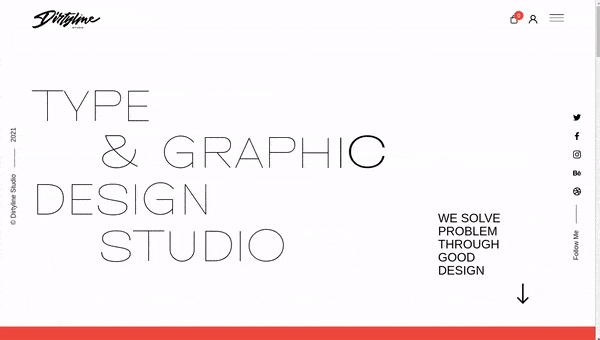
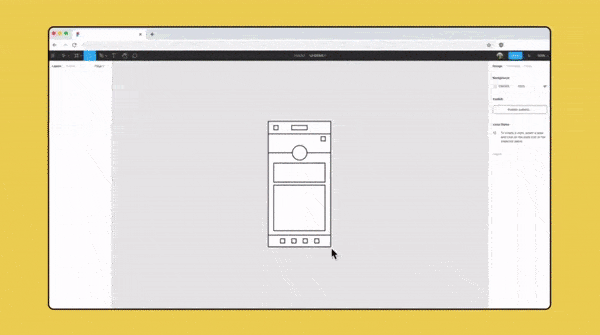
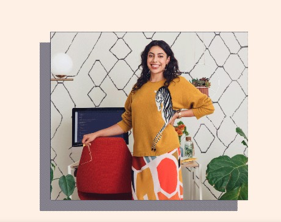
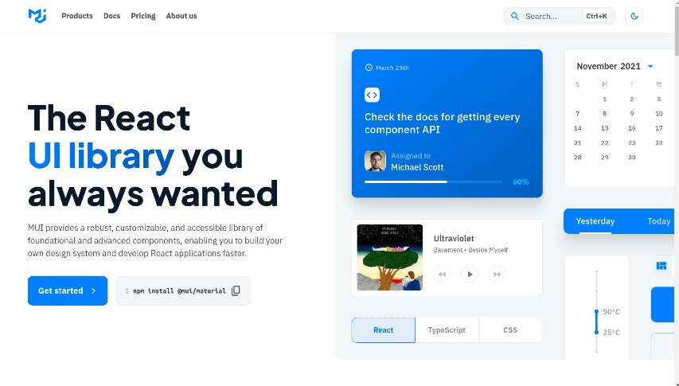
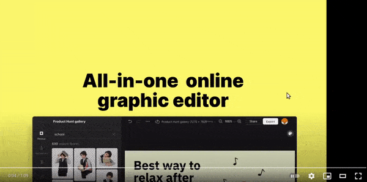

<!--
COMPRESS IMG
https://imagecompressor.io/

https://www.pexels.com/fr-fr/chercher/videos/product%20smartphone/

video tissue elegant, perhaps for bg parfumerie or marroquinerie

https://www.pexels.com/fr-fr/video/mode-rouge-danser-concevoir-7946212/

https://www.pexels.com/fr-fr/video/lumiere-et-ombre-feuilles-de-palmier-palmes-video-verticale-8559328/

***********
bijouterie
***********

https://www.pexels.com/fr-fr/video/mode-personne-main-centrale-9956209/

https://www.pexels.com/fr-fr/photo/mode-amour-gens-femme-9431884/

https://www.pexels.com/fr-fr/video/personne-mains-femme-modele-9432267/

https://www.pexels.com/fr-fr/video/mode-personne-femme-etre-assis-9432260/

https://www.pexels.com/fr-fr/photo/nourriture-mode-amour-sable-9431058/

https://www.pexels.com/fr-fr/video/personne-femme-pierres-portrait-9431061/

https://www.pexels.com/fr-fr/photo/nourriture-homme-gens-femme-9430423/

https://www.pexels.com/fr-fr/video/femme-pendre-bague-bijoux-9430549/

https://www.pexels.com/fr-fr/video/personne-mains-femme-table-9430535/

rococo bijouterie /fruits /erotic
CAN BE ALSO BE USED FOR FASHION

https://www.pexels.com/fr-fr/video/mode-manger-diversite-mariee-8193980/

https://www.pexels.com/fr-fr/video/mode-diversite-femelle-fan-8193754/

https://www.pexels.com/fr-fr/photo/mode-amour-gens-femme-8193709/

https://www.pexels.com/fr-fr/photo/mode-gens-femme-detente-8193726/

https://www.pexels.com/fr-fr/video/mode-homme-gens-femmes-8193618/
-----------

2 filles / amusent
https://www.pexels.com/fr-fr/video/restaurant-personne-femme-ordinateur-portable-9808504/

https://www.pexels.com/fr-fr/video/personne-bras-femme-main-9801508/

https://www.pexels.com/fr-fr/video/personne-bras-femme-main-9802367/

flower love
https://www.pexels.com/fr-fr/collections/portrait-qo8vxuc/

girl flower nice
https://www.pexels.com/fr-fr/photo/mode-gens-femme-jeune-fille-8422782/
https://www.pexels.com/fr-fr/video/rouge-femme-jaune-modele-7812682/

man floder nice
https://www.pexels.com/fr-fr/collections/men-with-flowers-cfdagx1/
-------------

cute young kids model
https://www.pexels.com/fr-fr/collections/fashion-in-the-wild-65s75w8/

textures video liquid
https://www.pexels.com/fr-fr/video/art-creatif-texture-abstrait-7565441/

business
maybe for some anylitical website, investment etc
https://www.pexels.com/fr-fr/video/femme-ordinateur-portable-travailler-etre-assis-7224507/

https://www.pexels.com/fr-fr/video/femme-batiments-travailler-etre-assis-7223726/

### for some bureaucratic website (no so serious)
https://www.pexels.com/fr-fr/collections/taxes-accounting-bill-lady-men-couple-gdoxyul/

--------

fashion

---------

eco fashion
https://www.pexels.com/fr-fr/video/personne-femme-gros-plan-tresses-9836646/

https://www.pexels.com/fr-fr/video/femmes-rochers-debout-regarder-9836597/

https://www.pexels.com/fr-fr/photo/mode-homme-gens-femme-9836454/

https://www.pexels.com/fr-fr/photo/mode-diversite-tenue-elegant-9834927/

https://www.pexels.com/fr-fr/photo/mode-homme-plage-amour-9834555/

https://www.pexels.com/fr-fr/video/mer-eau-ocean-femmes-9834892/

https://www.pexels.com/fr-fr/collections/moon-o5ed9c8/
---------

https://www.pexels.com/fr-fr/video/mode-femme-modele-style-6984840/

https://www.pexels.com/fr-fr/video/personne-femme-etre-assis-modele-6984843/

https://www.pexels.com/fr-fr/video/ville-mode-homme-couple-10200810/

https://www.pexels.com/fr-fr/collections/oncology-bald-ulk3664/

erotic lesbian website
https://www.pexels.com/fr-fr/video/manger-sucre-sourire-rose-5702127/

https://www.pexels.com/fr-fr/collections/russian-style-syrhcm3/

langerie
https://www.pexels.com/fr-fr/video/gens-femmes-debout-portrait-10212064/

https://www.pexels.com/fr-fr/collections/skin-color-yekjn5t/

******************

 

https://maximorlov.com/deploying-to-github-pages-dont-forget-to-fix-your-links/

https://www.calligraphr.com/en/

https://htmlcolorcodes.com/
https://pixlr.com/x/
https://www.photopea.com/
https://pixlr.com/e/

https://webgradients.com/

https://www.toptal.com/designers/htmlarrows/arrows/

https://khaledkzy.github.io/pixel-vh-vw-converter/

http://ami.responsivedesign.is/#
https://www.websiteplanet.com/webtools/responsive-checker/?url=https%3A%2F%2Fwww.melissamurillo.com%2F

https://blog.bitsrc.io/transform-an-svg-into-a-react-component-with-svgr-8d2ba10f424c

https://blog.logrocket.com/how-to-use-svgs-in-react/

https://www.freecodecamp.org/news/how-to-use-svg-icons-in-react-with-react-icons-and-font-awesome/

https://www.w3schools.com/css/css3_animations.asp
https://thoughtbot.com/blog/transitions-and-transforms

----------------
smartphone ad videos
---------------

general

https://www.pexels.com/fr-fr/chercher/videos/smartphone%20accessories/

-->

<!--

https://www.mockupworld.co/free/iphone-12-mockup-kit/

https://www.mockupworld.co/free/iphone-12-clay-style-mockup-set/

https://www.mockupworld.co/free/vinyl-record-mockup-set/

https://www.mockupworld.co/free/hanging-vertical-poster-mockup/

https://www.mockupworld.co/free/floating-ipad-air-mockup-set/

https://www.mockupworld.co/free/iphone-11-showcase-mockup-set/

https://www.mockupworld.co/free/paper-a4-us-letter-presentation-mockup/

https://www.mockupworld.co/free/hands-holding-ipad-pro-mockup/

https://www.mockupworld.co/free/iphone-13-clay-style-mockup/

https://www.mockupworld.co/free/hand-holding-iphone-mockup/

https://www.mockupworld.co/free/ipad-pro-with-magic-keyboard-mockup/

slider

no responsive

https://codesandbox.io/s/draggable-slider-with-gsap-c5lem?file=/src/components/Slider.js

https://www.npmjs.com/package/react-draggable-slider

private
https://codesandbox.io/s/app-store-ui-using-react-and-framer-motion-ecgc2?file=/src/CardList.tsx

https://www.youtube.com/watch?v=IOfoHJC4hwk

https://www.npmjs.com/package/react-simple-image-slider

##### [Lists and Keys](https://reactjs.org/docs/lists-and-keys.html)

https://vsco.co/

nth child selector
https://www.youtube.com/watch?v=TVj1avJj8a8

https://javascript.info/constructor-new

https://www.youtube.com/watch?v=bq_jZY6Skto&t=354s

https://www.youtube.com/watch?v=iDuOjpRGYE4&list=PL_c9BZzLwBRLVh9OdCBYFEql6esA6aRsi&index=75

https://stackoverflow.com/questions/45477625/how-to-calculate-the-amount-for-total-hours-in-javascript

https://stackoverflow.com/questions/53860875/calculating-overtime-with-momentjs-and-ranges

https://www.youtube.com/watch?v=N3cq0BHDMOY

How to Code a Piano App with React JS
https://www.youtube.com/watch?v=kMf1XWVY2cA

https://naveenr.net/unicode-character-set-and-utf-8-utf-16-utf-32-encoding/

https://mui.com/components/slider/
-->

 

 

# BASIC TOOLS

 

## Fonts 🍦

#### [Premium and Free: dirtylinestudio](https://dirtylinestudio.com/freebies/)

##### [examples and free fonts](https://www.awwwards.com/awwwards/collections/free-fonts/)

##### [free: fonts.google](https://fonts.google.com/)

##### [dafont](https://www.dafont.com/fr/)

 
 

#### SCSS related

##### [Confused About REM and EM?](https://j.eremy.net/confused-about-rem-and-em/)

##### [Font Face](https://gist.github.com/jonathantneal/d0460e5c2d5d7f9bc5e6)

 

##### [How to Bend and Set Text on a Circle With CSS](https://1stwebdesigner.com/set-text-on-a-circle-with-css/)

##### [Circle text rotation with SVG](https://codepen.io/Shaikat/pen/PapGpr)

##### [Emblem - Auto generate circular text](https://codepen.io/georgehastings/pen/akZxaz)

 

##### [82 CSS Text Effects](https://freefrontend.com/css-text-effects/)

 

##### [How TO - Responsive Text](https://www.w3schools.com/howto/howto_css_responsive_text.asp)

##### [Semantic HTML](https://www.pluralsight.com/guides/semantic-html)

> There are over a billion websites on the Internet. Many of them are made a long time ago and have not been updated with HTML features. **As such, search engines move past these websites, and viewers find these websites difficult to read.**  
> One of the most important features of HTML5 is its semantics. Semantic HTML refers to syntax that makes the HTML more comprehensible by better defining the different sections and layout of web pages. It makes web pages more informative and adaptable, allowing browsers and search engines to better interpret content. For example, instead of using div id="header" you can use a header tag.

 

 

## Colors

#### [ Hex color codes: htmlcolorcodes](https://htmlcolorcodes.com/)

#### [ HSLa](https://css-tricks.com/yay-for-hsla/)

 
 

## Gradients 🌈

#### What are gradients?

##### [Linear Gradients](https://www.w3schools.com/css/css3_gradients.asp)

#### Radial Gradients

##### [CSS Radial Gradients](https://www.w3schools.com/css/css3_gradients_radial.asp)

 

##### [webgradients](https://webgradients.com/)

##### [cssgradient](https://cssgradient.io/gradient-backgrounds)

 

##### Gradients inspirational websites

##### [gradients-in-web-design-elements](https://www.awwwards.com/gradients-in-web-design-elements.html)

##### [How TO - Background Gradient on Scroll](https://www.w3schools.com/howto/howto_css_bg_gradient_scroll.asp))

 
 

##### SCSS Colors Functions

##### [Controlling color with Sass color functions](https://thoughtbot.com/blog/controlling-color-with-sass-color-functions)

 

 

#### Interesting

##### [UX/UI Design Trends 2022](https://youtu.be/YRIHdCJqQOg)

 

 

#### HTML Symbols ⬅️

##### [symbols: arrows etc](https://www.toptal.com/designers/htmlarrows/symbols/)

# Icons 🐿️

 

> **JPEG** and SVG both are a type of image format to store images. JPEG is a raster image format and uses lossy compression algorithm and image **may lost some of its data** whereas <u>SVG</u> is a text based image format and uses mathematical structures to represent a image and is **highly scalable**.

##### [free and premium svg icons](https://www.iconfinder.com/)

##### [free SVG](https://www.svgrepo.com/)

##### [free and premium icons](https://freeicons.io/)

##### [free icons: PNG, SVG, EPS, PSD and BASE 64 formats. ](https://www.flaticon.com/)

## Animated Icons 👍

#### [Animated Icons](https://icons8.com/animated-icons)

 

#### [Font Awesome](https://fontawesome.com/)

[How To Use Font Awesome 5 with React](https://www.digitalocean.com/community/tutorials/how-to-use-font-awesome-5-with-react)

 

# Figma 🍨

#### [figma](https://www.figma.com/)

> Figma is a vector graphics editor and prototyping tool which is primarily web-based, with additional offline features enabled by desktop applications for macOS and Windows. The Figma Mirror companion apps for Android and iOS allow viewing Figma prototypes in real-time on mobile devices

- [Figma tutorial 1](https://www.youtube.com/watch?v=dXQ7IHkTiMM)
- [Figma tutorial 2](https://www.youtube.com/watch?v=EK-pHkc5EL4)

 

## SVG generators 🖐️

#### [draw svg](https://editor.method.ac/)

 

#### [pattern](https://pattern.monster/)

- perfect for something like this:

 

- perfect for morphing animations

#### [svg-shape-generator](https://www.softr.io/tools/svg-shape-generator)

- check the tutorial [Create an SVG blob morphing animation with no JavaScript](https://www.youtube.com/watch?v=A1GeA1nF0nU)

[things you can do](https://wadeandleta.com/studio)

 

#### Retouching images to add to your app

##### [Img retouch: pixlr.com](https://pixlr.com/x/)

##### [Img retouch: www.photopea.com ](https://www.photopea.com/)

##### [Img retouch: pixlr.com/e](https://pixlr.com/e/)

 

### Video

##### [Beautiful Free Stock Video Footage](https://coverr.co/)

##### [pexel videos](https://www.pexels.com/fr-fr/videos/)

 

### IMG styles scss/css

#### [Use CSS ::before and ::after for simple, spicy image overlays](https://bryanlrobinson.com/blog/how-to-css-after-elements-for-background-overlays/)

#### [A guide to CSS animations using clip-path()](https://blog.logrocket.com/guide-to-css-animations-using-clip-path/)

 
 

## Material UI

> **MUI** provides a simple, **customizable, and accessible library of React components**. Follow your own design system, or start with Material Design.

> Material-UI is simply a library that allows us to import and use different components to create a user interface in our React applications. **This saves a significant amount of time** since the developers do not need to write everything from scratch.

 

### Animations 🌈

#### [framer motion](https://www.framer.com/motion/)

#### [framer motion Developers](https://www.framer.com/docs/examples/)

 

#### [cloud sun | Animation Direction Example](https://codepen.io/rachelcope/pen/YPzZrg)

 

### Transitions

##### [AOS preview](https://michalsnik.github.io/aos/)

##### [AOS documentation](https://github.com/michalsnik/aos#animations)

##### [Page Animations On Scrolling In ReactJS](https://www.youtube.com/watch?v=JcHLxzrsRS4)

 

#### Transform CSS Generator

##### [Transform CSS Generator: Scale, Rotate, Translate and Skew](https://html-css-js.com/css/generator/transform/)

 

 

# Mockups tools

##### [All free Mockups: Magazines & Books, iPhone, iPad, MacBook, iMac, Packaging, Signs, Vehicles, Apparel, Food and Beverages, Cosmetics and more!](https://www.mockupworld.co/)

 
 

# FREE images 🍨

#### [unsplash: Food & Drink](https://unsplash.com/t/food-drink)

#### [unsplash: fashion](https://unsplash.com/t/fashion)

 

#### [Pexels](https://www.pexels.com/search/fashion/)

 

#### Social media tools

#### [Mega Creator ](https://icons8.com/mega-creator)

> **Mega Creator** gives you unlimited ways to make astonishing design for every need. Design new stuff with graphics from the in-house production company.

 

 

# Tutorials

##### [superhi.com/tutorials](https://library.superhi.com/tutorials)

##### [panning](https://library.superhi.com/posts/how-to-add-panning-to-a-gallery-with-css-and-javascript)

<!-- https://library.superhi.com/posts/how-to-make-an-overlay-logo-with-an-outline-effect-using-css -->

# Schools

##### [codecademy](https://www.codecademy.com/)

#### [superhi](https://www.superhi.com/)

##### [Here Are 115 Coursera Certificates You Can Now Earn for Free (During the Coronavirus Pandemic)](https://www.freecodecamp.org/news/coronavirus-coursera-free-certificate/?fbclid=IwAR10lMD7INWsEc1e0YIVsGUk0rIORAMKkVhSQ1THsNC2xeS441lEDDLQYjw)

 

 

# Inspiration

##### [awwwards](https://www.awwwards.com/)

##### [uijar](https://uijar.com/)

##### [brutalistwebsites](https://brutalistwebsites.com/)

 
 
 
 

# Important 🔴

#### [What are viewport units?](https://css-tricks.com/fun-viewport-units/)

#### [Responsive Web Design – How to Make a Website Look Good on Phones and Tablets](https://www.freecodecamp.org/news/responsive-web-design-how-to-make-a-website-look-good-on-phones-and-tablets/?fbclid=IwAR0YCifjBx1kjMwNlvHHXvwy7pP_0JcasNasWbbyrojng5i9Ddnp3Dmqexw)

##### [Why Site Speed is Critical for SEO – and How to Speed Up Your Site](https://www.freecodecamp.org/news/why-site-speed-is-critical-for-seo-and-how-to-speed-up-your-site/?fbclid=IwAR1lS5Jl8e9HT_BcIwe58qIf_DpoYC3KsmkHZRlMto1tAWhqE0UGEouaE5o)

##### [how-to-use-styles-in-a-react / Why Do People Argue Over CSS-in-JS?](https://www.iamtimsmith.com/blog/how-to-use-styles-in-a-react-js-application/)

 
 

 

# SCSS

#### [How to combine SASS color functions and CSS Variables](https://codyhouse.co/blog/post/how-to-combine-sass-color-functions-and-css-variables)

 

#### [box-shadow](https://css-tricks.com/almanac/properties/b/box-shadow/)

#### [filter](https://developer.mozilla.org/en-US/docs/Web/CSS/filter)

#### [mix-blend-mode](https://developer.mozilla.org/en-US/docs/Web/CSS/mix-blend-mode)

#### [CSS-only dark mode](https://kleinfreund.de/css-only-dark-mode/)

 

#### [CSS Tutorial For Beginners 23 - nth Child Selectors](https://youtu.be/TVj1avJj8a8)

#### [Create Diagonal Layouts Like It's 2020](https://9elements.com/blog/pure-css-diagonal-layouts/)

#### [10 Ways to Hide Elements in CSS](https://www.sitepoint.com/hide-elements-in-css/)

#### [FLEXBOX FROGGY](https://flexboxfroggy.com/)
